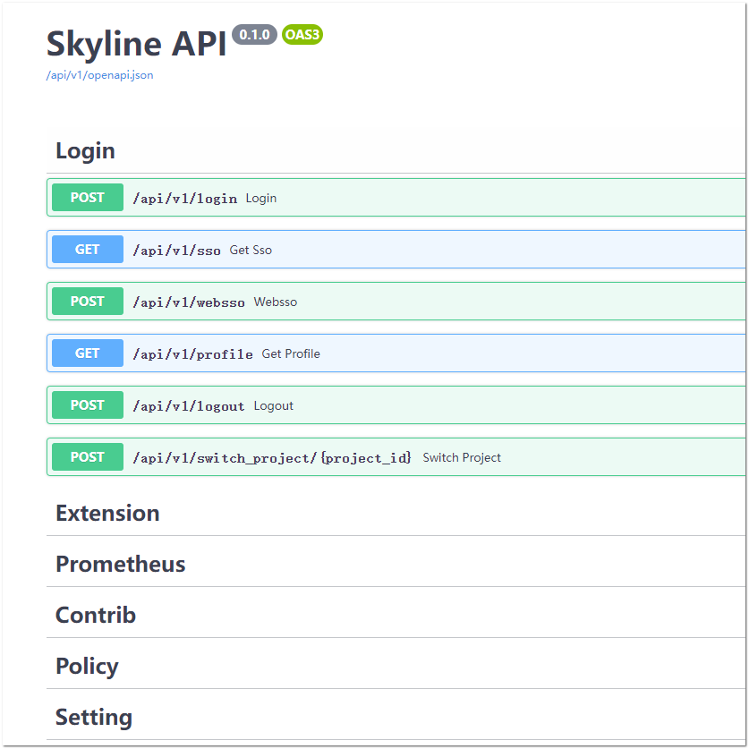

.. _verify-install:

Verify Skyline APIServer operation
~~~~~~~~~~~~~~~~~~~~~~~~~~~~~~~~~~

Verify operation of the Skyline APIServer service

.. note::

   Only available when you use :ref:`source-install-ubuntu`.

.. note::

   Visit the OpenAPI swagger of Skyline APIServer.

#. Open a web browser and navigate to the Skyline APIServer OpenAPI
   swagger ``http://xxx:28000/docs``:

